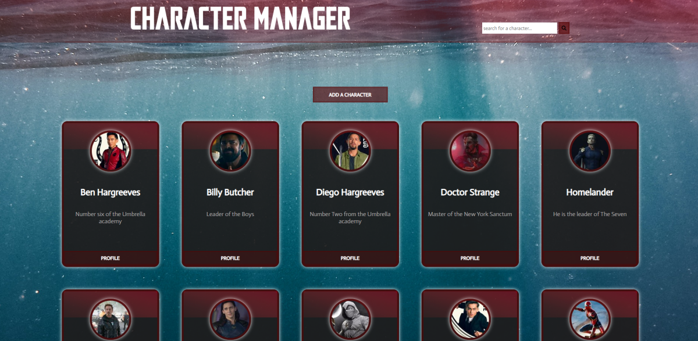

# character-manager-js

## Introduction

We had to create an app " Character-manager ", using JS with the help of an API, learning how to use different kind of request.

## Functionalities

- Show all the profile from the API
- Search for one profile to display alone
- Create a new profile and push it into the API
- delete a profile from the API
- Update a profile from the API

## Main page

## Technologies

HTML, SCSS, JS
